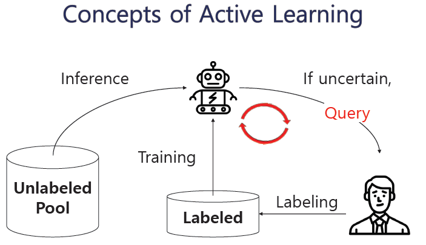

# Active_Learning_Summary

Created: 2021년 1월 28일
Subject: Active Learning, KoBERT, Text Classification

# 1. Active Learning

- Label Annotation에 들어가는 노력을 줄이기 위한 방법론

- 기존의 모델들을 활용해 unlabeled data에 대한 추론을 진행하고 불확실성이 높은 데이터를 우선적으로 **human annotator에게 Labeling을 요청**하는 방법
Random Sampling보다 더 좋은 성능
**어떠한 기준으로 해당 데이터를 선정하는지가 중요**

## Query Strategy

### 1) Uncertainty sampling

### (1) Least Confident Sampling

- 모델이 예측한 [각 클래스에 속할 확률] 중 [Top1 확률]이 [가장 낮은 데이터]부터 레이블링 지시

### (2) Margin Sampling

- 모델이 예측한 [각 클래스에 속할 확률] 중 [Top1, Top2 확률]의 차이가 [가장 적은 데이터]부터 레이블링 지시
- Binary classification에서는 LC와 동일한 결과

### (3) Entropy Sampling

- 모델이 예측한 [각 클래스에 속할 확률]을 이용해, [엔트로피가 가장 큰 데이터]부터 레이블링 지시

### 2) Query-By-Committee

- 구성원 간의 의견 차이를 측정하는 척도

### (1) vote entropy

엔트로피 기반의 uncertainly sampling를 QBC로 일반화한 것

### (2) 평균 Kullback-Leibler(KL) divergence 기반

가장 정보량이 높은 쿼리는 라벨 분포 간의 평균적인 차이가 가장 큰 쿼리

### 3)Expected Model Change

- 대표적인 방법은 Expected Gradient Length(EGL) 전략

### 4) Core-set

### 5) Learning Loss

## Text Classification에서의 적용

[A Survey of Active Learning for Text Classification using Deep Neural Networks.pdf](AL/A_Survey_of_Active_Learning_for_Text_Classification_using_Deep_Neural_Networks.pdf)

- 위의 논문에 따르면 Query Strategy는 크게 Data-based, Model-based, Prediction-based로 나뉠 수 있음 (연구자에 따라 나누는 기준은 달라질 수 있음)

- 그 중 Text Classifcation에 자주 사용되는 방법은 **Prediction-Based의 Uncertainty sampling과 Prediction-Based의 disagreement (**Query by committee)이고 2가지 방법을 중점으로 실험 진행

# 2. 실험

## 2.1 Dataset

- 실험에는 총 3개의 **데이터셋**이 활용
- Binary classification과 Multiclass Classification을 동시에 수행하여 **task 난이도가 active learning에 미치는 영향력**을 확인

### (1) NSMC(Naver sentiment movie corpus) : Binary Classification

네이버 영화 리뷰 긍부정 이진분류
Training set: 150,000
Test set: 50,000

### (2) NEWS-6 : Multiclass Classification

웹에서 수집된 뉴스 데이터. 6개 카테고리 분류

Train set: 41,850

Test set: 17,936

### (3) NEWS-7 : Multiclass Classification

웹에서 수집된 뉴스 데이터. 7개 카테고리 분류

총 140만건. Train, Test 9:1로 나눠서 10%만 사용

Train set : 140,000

Test set : 28,000

## 2.2 실험 조건

- **Model은 KoBERT** 사용

### 1) Query Strategy

총 4가지 활용. 대조군으로 Random Sampling 사용 (데이터셋별로 생략되는 경우도 있음)

(1) Least Confidence Sampling (Uncertainty sampling)
(2) Entropy Sampling (Uncertainty sampling) 
(3) Margin Sampling (Uncertainty sampling) (NEWS-7에서만 실험 진행)
(4) Query By Committee (NEWS-7에서만 실험 진행)
L**earning Rate : [5e-4, 2e-5, 1e-5]** (기존에는 1e-5 하나의 모델만 사용)

### 2)Anootated data size

(스텝별로 레이블링되는 데이터 사이즈, 하루 1명 1000건 레이블링 기준)

(1) 1000 (1명)
(2) 3000 (3명)

### 기타 fine-tuning option

- epochs = 3
- optimizer = AdamW
- lr = 2e-5
- Max_seq_length
NSMC = 150
NEWS-6, NEWS-7 = 512
- Batch size
    - Train batch size
    NSMC = 16
    NEWS-6, NEWS-7 = 8
    - Test batch size
    NSMC = 128
    NEWS-6, NEWS-7 = 64

## 2.3 실험과정

1. Training set에서 Anootated data size만큼 임의 선택해 BERT classifier 학습
2. Test set으로 성능 확인
3. 학습된 모델로 Training set에서 학습에 사용된 데이터를 제외하고 추론을 진행해 **Query Strategy**에 따라 Anootated data size만큼 데이터 선택
4. 위에서 선택된 데이터를 포함시켜 1~3의 과정을 재진행

### 목표

- active learning 기법들과 random sampling 사이의 성능 차이 확인
- 기준 성능을 도달하기 위한 데이터의 양 확인

## 2.4 실험결과

## 2.4.1 NSMC

### 0) 대조군: 20%, 40%, 100%

2% ⇒ 79.6%

20% ⇒ 87.33%

**40% ⇒ 88.71% (active learning에서는 전체 데이터의 40%까지 학습)**

100% ⇒ 90.01%

### 1) Data size / times = 3000

- 총 학습 시간 9시간

### 2) Data size / times = 1000

### 비교

- 튀는 부분을 고려하고 경향성만 보면 sapling을 통해 학습한 것이, sampling size가 작을수록 좋은 성능을 보임
- 총 학습 시간은 약 26시간

### ⇒ **학습 과정에 생기는 문제에 대한 해결 필요**

## 2.4.2 NSMC retrain

### Experiment Design

- 2.4.1에서는 스텝별로 **학습이 전혀 되지 않은 모델**에서 **학습**을 진행했음
위 실험의 문제점
(1) 학습 속도가 **오래 걸림**
(2) 학습이 **불안정**

    

- 위의 문제를 줄이기 위해서 이전 스텝에서 학습된 모델을 그대로 사용하는 방법 실험

### 실험 과정

1. Training set에서 n개 임의 선택해 BERT classifier 학습
2. 학습된 모델로 Training set에서 학습에 사용된 데이터를 제외하고 추론을 진행해 **Query Strategy**에 따라 n개의 데이터 선택
3. 1에서 **학습된 model에 선택된 n개의 데이터만** 추가적으로 학습 진행(기존과 동일한 학습 셋팅)
4. 위의 과정을 원하는 step만큼 반복

### (1) Data size / times = 3000

- 완전히 새롭게 학습 시키는 것보다 학습이 안정적이고 Random Sampling에 비해서 1~2% 정도의 성능 향상이 있음

### 기대 효과

- Least Confidence Sampling과 Entropy Sampling을 사용했을 때 Random Sampling이 테스트셋에 대하여 학습하는 것을 포함하고 **추가적으로 더 학습하기를 기대**

    

- 전체가 공통적으로 학습하는 비율이 약 82%~83%
Least Confidence Sampling과 Entropy Sampling이 Random Sampling에 1~2% 가까이 추가적으로 학습하긴 하지만 **기대한대로 random sampling을 포괄하는 형태로 나타나지는 않**

### 학습 단계별 active learning 성능

- retrain에서는 각 스텝별로 추가되는 데이터에 대해서만 학습을 진행하기 때문에 해당 데이터로 샘플링된 모델의 성능 확인 필요
각 단계별로 샘플링된 전체를 이용해 모델링을 했을 때의 성능은 아래와 같음
여기서도 **문제점이 동일한 데이터로 학습을 진행해도 학습 성능이 일정하지 않음**

### (2) Data size / times = 1000

- 완전히 새롭게 학습 시키는 것보다 학습이 안정적이고 Random Samplin에 비해서 1~3% 정도의 성능 향상이 있음

- 전체가 공통적으로 학습하는 비율이 약 83%~84%
Least Confidence Sampling과 Entropy Sampling이 Random Sampling에 1~2% 가까이 추가적으로 학습
- 불안정성 때문에 여러번 실험을 했지만 데이터 학습 단계별 성능을 구하기에 어려움이 있었음

## 2.4.3 NEWS-6

- 전체 데이터의 50%까지 학습을 진행

### 대조군: 10%~50%, 100%

## 1) Data_size = 1000

- 완전히 새롭게 학습 시키는 것보다 학습이 안정적이고 Random Sampling에 비해서 최대 3% 정도의 성능 향상이 있음
전체 데이터의 20% 전후로 학습시킬 때 성능 증가폭이 가장 컸음
- NSMC에서 생겼던 불안정한 학습 문제는 해결. 데이터셋의 문제였을 것으로 추정

- 전체가 공통적으로 학습하는 비율이 약 83%~84% (차이가 가장 큰 step5 확인)
Least Confidence Sampling과 Entropy Sampling이 Random Sampling에 2~3% 가까이 추가적으로 학습

### 모델별 성능 비교

- Least Confidence Sampling과 Entropy Sampling을 사용하면 전체 데이터의 50% 정도만 학습해도 전체 데이터의 학습했을 때와 거의 유사한 성능을 보임 (0.2~0.3% 차이)

### ⇒ news-6에서는 난이도가 쉬워서 그런지 active learning의 성능이 전체 데이터의 30%를 넘어가니 안정이 되었고 news-7는 비교적 난이도가 어려워서 active learning의 성능이 지속적으로 증가

### (3)

### Label별 Accuracy 비교

### sampling 되는 Label 비율 비교

### 학습 방법별로 정확도와 label이 뽑히는 양상을 비교

- Random Sampling의 경우 모든 스텝에서 균등하게 레이블이 샘플링되는 반면에
Least Confidence Sampling과 Entropy Sampling에서는 **난이도가 레이블들 위주로 샘플링**이 이루어지고 해당 레이블들에 대한 성능이 급격히 좋아지는 모습을 관찰

## 2.4.4 NEWS-7

### (0) 대조군

11.2만건(10%) ⇒ **86.04%**

cf) 33.6만건(30%) ⇒ 88.44% 

112만건(100%) ⇒ 91.33% 

## 1)  Data_size = 3000

- QBC의 경우 LR이 다른 3개의 모델을 이용해 샘플링을 하고 성능은 다른 모델과 동일하게 2e-5를 통해 측정

- 모든 AL 기법들이 random sampling보다는 좋은 결과
Uncertainty sampling 기법 3개는 거의 유사한 성능을 보이고 QBC는 거기에 살짝 못 미치는 성능

- active learning의 모든 기법에서 Random Samplin에 비해서 1~2% 정도의 안정적인 성능 향상
또한 NSMC에서는 불안정했던 실험 결과가 해당 데이터셋에서는 안정적으로 산출

- 전체가 공통적으로 학습하는 비율이 약 80%
모든 AL 기법들이 Random Sampling에 2% 가까이 추가적으로 학습. 기대한만큼 random sampling을 포괄하는 형태로 나타나지는 않음

- 이전 실험보다 task가 상대적으로 어렵기 때문에 비교적 많은 데이터를 실험해도 지속적인 성능향상을 관찰할 수 있었음.
성능 향상이 어느 정도 지속되고 **전체 데이터의 성능까지 도달하기 위한 데이터 양을 확인하기 위해 추가적인 실험 진행 예정**

### 샘플링되는 레이블

- Least Confidence Sampling과 Entropy Sampling에 기대하는 것은 **기존에 잘 맞추지 못하던 Label에 대해 우선적으로 학습을 진행해 빠르게 accuracy를 높이기를 기대**

### Label별 Accuracy 비교

- Uncertatin sampling 기법 3개는 거의 동일한 결과를 보여, LC와 QBC, random sampling만 비교

- 첫 번째 스텝에서 문화, 사회, 경제의 정확도가 낮고 opinion의 정확도가 높은 것을 확인

### sampling 되는 Label 비율 비교

### 학습 방법별로 문화, opinion의 정확도와 label이 뽑히는 양상을 비교

- Random Sampling의 경우 모든 스텝에서 균등하게 레이블이 샘플링되는 반면에
Least Confidence Sampling과 Entropy Sampling에서는 **난이도가 여러운 문화, 사회, 경제 레이블을 위주로 샘플링**이 이루어지고 해당 레이블들에 대한 성능이 급격히 좋아지는 모습을 관찰
더불어 난이도가 비교적으로 낮은 opinion에서도 성능 향상폭이 더 큼

### Least Confidence sampling과 비교

- Label이 학습되는 양상에 눈에 띄는 큰 차이는 없으나 sampling되는 양상은 매우 다름
Unceratainty sampling에서는 어려운 label인 경제, 문화 등의 label이 지속적으로 많이 되는 sampling되는 반면에 **QBC에서는 한번씩 번갈아가면서 많은 양의 sampling이 진행**
- QBC에서는 학습 과정에서 경제, 문화 사이에 혼동이 자주 발생하는 것으로 추정
n스텝에서 경제, 문화 label를 함께 경제로 예측을 하면, n스텝에서는 문화가 많이 sampling 되고 n+1스텝에서 반대로 문화로 예측을 하면, 경제가 많이 sampling 되는 양상을 반복하는 것으로 추정

## 2) Data size = 1000

- 모든 AL 기법들이 random sampling보다는 좋은 결과. AL 기법들 사이에서는 거의 동일한 성능

- 기존의 Uncertainty 방법들과 비교하면 거의 비슷한 성능

- 전체가 공통적으로 학습하는 비율이 약 80%
기대한만큼 random sampling을 포괄하는 형태로 나타나지는 않음

## ⇒ AL 기법 사이에서 조금 다른 양상을 보이긴 하지만 **난이도가 어려운 레이블들이 먼저 라벨링 되어 학습이 이루어져 학습이 빠르게 진행되는 모습은 동일**

### 샘플링되는 레이블

### Label별 Accuracy 비교

- 첫 번째 스텝에서 문화, 사회, 경제의 정확도가 낮고 opinion의 정확도가 높은 것을 확인

    

### sampling 되는 Label 비율 비교

다른 샘플링과 다르게 굉장히 불규칙적하게 샘플링

- Label sapling 양상이 Random sampling과도 다르지만 Unceratainty sapling과도 다른 양상

### 문화, 경제, opinion의 정확도와 label이 뽑히는 양상 비교

- Random Sampling의 경우 모든 스텝에서 균등하게 레이블이 샘플링되는 반면에
Least Confidence Sampling과 Entropy Sampling에서는 **난이도가 여러운 문화, 사회, 경제 레이블을 위주로 샘플링**이 이루어지고 해당 레이블들에 대한 성능이 급격히 좋아지는 모습을 관찰
더불어 난이도가 비교적으로 낮은 opinion에서도 성능 향상폭이 더 큼

### Least Confidence sampling과 비교

- Label이 학습되는 양상에 눈에 띄는 큰 차이는 없으나 sampling되는 양상은 매우 다름
Unceratainty sampling에서는 어려운 label인 경제, 문화 등의 label이 지속적으로 많이 되는 sampling되는 반면에 **QBC에서는 한번씩 번갈아가면서 많은 양의 sampling이 진행**
- QBC에서는 학습 과정에서 경제, 문화 사이에 혼동이 자주 발생하는 것으로 추정
n스텝에서 경제, 문화 label를 함께 경제로 예측을 하면, n스텝에서는 문화가 많이 sampling 되고 n+1스텝에서 반대로 문화로 예측을 하면, 경제가 많이 sampling 되는 양상을 반복하는 것으로 추정

# 3. AL의 효과

- **N개의 데이터를 사용했을 때 동일한 성능에 도달하기 위해 필요한 데이터의 사이즈 수 확인**
- NEWS-7으로 실험

### 3.1 N = 21000 ⇒ 40%~50%

- N = 21000과 유사한 성능을 내기 위해서 40% 정도의 데이터만 있으면 됨

## 3.2 N = 7000

- data size=1000일 때 N = 7000과  유사한 성능을 내기 위해서 70% 정도의 데이터만 있으면 됨

- data size=500일 때도 유사하게 70% 정도의 데이터만 있으면 됨

- epoch=3으로 유지하고 data size=200으로 줄이니 학습이 굉장히 불안정해짐

## 3.3 N = 3000

- 학습 데이터 수가 적어지니까 epoch=3으로는 정상적인 학습이 이루어지지 않음

- epoch =15로 설정하면 약 70% 수준에서 원하는 기준 성능과 유사해짐
epoch = 3으로 하면 일반적인 학습보다 오히려 성능이 떨어짐

## 3.4 N = 1000

- 역시나 3epoch로는 학습이 정상적으로 이루어지지 않음

- epoch=15에서는 60%의 데이터만 있으면 기준 성능을 얻을 수 있음

## 실험결과 정리(필요한 데이터 양)

### 1. epoch=3, N = 21000 에서는 기준 성능을 위해 40~50%, N=7000에서는 70%  필요, N≤3000 이면 정상적인 학습이 이루어지지 않음
data size ≤ 200에서는 학습이 정상적으로 진행되지 않음

### 2. epoch=15 , N=3000에서는 70%, N=1000에서는 60% 필요

# 4. AL for NLP

- 기존에 실험에서 좋은 성능으 보였던 Least Confidence Sampling(LC)을 적용 가능한 task 탐색
- **최근 AL 기법의 발전들은 CNN을 이용하는 Vision 분야에서 이루어짐.**  NLP 분야에서는 아직 연구가 많지 않은 상황. 바로 적용하기에 적절하지 않은 기법들도 있음

## 4.1 NER

[DEEP ACTIVE LEARNING FOR NAMED ENTITY RECOGNITION.pdf](AL/DEEP_ACTIVE_LEARNING_FOR_NAMED_ENTITY_RECOGNITION.pdf)

- BERT NER fine-tuning에 직접적으로 active learning을 적용한 사례는 찾아보기 힘들었지만 NER에 LC를 적용한 사례는 위의 논문에서 찾을 수 있었음
- sequential하게 classifier를 계속 사용하는 것을 제외하면 classificaton과 동일하게 적용

- xij = i th word, j th character
각각의 NER을 예측하는 신뢰도가 가장 떨어지는 문장을 선택

[Active learning approach using a modifed least confdence sampling.pdf](AL/Active_learning_approach_using_a_modifed_least_confdence_sampling.pdf)

- 또한 LC 기법을 조금 변형해서 사용하기도 함

## 4.2 MRC

- MRC에서도 마찬가지로 BERT fine-tuning에 직접적으로 active learning을 적용한 사례는 찾아보기 힘들었음

    [UNCERTAINTY-BASED ADAPTIVE LEARNING FOR READING COMPREGENSION.pdf](AL/UNCERTAINTY-BASED_ADAPTIVE_LEARNING_FOR_READING_COMPREGENSION.pdf)

- 위의 논문은 아직 review 중인 논문이지만 BERT MRC fine-tuning에 AL 기법을 적용한 논문
- MRC 또한 start token과 end token에 대한 classification 형태로 진행이 되기 때문에 유사하게 적용 할 수 있음

## 4.3 Summarization

- 레퍼런스 없음